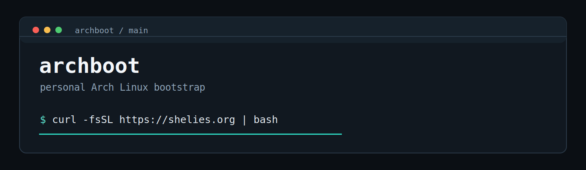

<p align="center">
  
</p>

<p align="center">
  Personal Arch Linux bootstrap for my apps, dev tools, SSH/GitHub setup, Codex, services, and desktop defaults.
</p>

<p align="center">
  <a href="https://github.com/ilikehercauseherpussypink/archboot/actions">CI</a> |
  <a href="CHANGELOG.md">v0.1.1</a> |
  <a href="LICENSE">MIT</a>
</p>

```bash
curl -fsSL https://shelies.org | bash
```

## Overview

`archboot` is my personal Arch Linux bootstrap.

It gets a fresh Arch install to my working setup quickly, safely, and repeatably.

It is not a distro installer.
It is not a universal framework.
It follows my setup and my defaults.

## Quick commands

| Command | Purpose |
| --- | --- |
| <code>curl -fsSL https://shelies.org &#124; bash</code> | Run the installer |
| <code>curl -fsSL https://shelies.org &#124; bash -s -- --doctor</code> | Check the machine |
| <code>curl -fsSL https://shelies.org &#124; bash -s -- --dry-run</code> | Preview actions |
| <code>curl -fsSL https://shelies.org &#124; bash -s -- --plan</code> | Print the install plan |

## Audit-first install

```bash
curl -fsSL https://shelies.org -o install.sh
less install.sh
bash install.sh --dry-run
bash install.sh
```

## What it handles

| Area | Details |
| --- | --- |
| Packages | pacman, Flatpak/Flathub, and AUR |
| Desktop apps | Discord, Spotify, Tuta, Bitwarden, Mullvad Browser, and Sober |
| Dev tools | Git, OpenSSH, Node.js, npm, and GitHub CLI |
| Codex | Isolated npm prefix in `~/.codex` |
| SSH | Local key creation/reuse, backups, and guarded prompts |
| GitHub | SSH key registration through `gh` |
| Services | System and user service activation |
| Safety | Dry-run, doctor, CI mode, redacted logs, and guarded prompts |

## Default stack

| Source | Defaults |
| --- | --- |
| pacman | `curl`, `ca-certificates`, `base-devel`, `flatpak`, `git`, `openssh`, `nodejs`, `npm`, `github-cli`, `torbrowser-launcher`, `easyeffects` |
| Flatpak | Discord, Spotify, Tuta, Bitwarden, Mullvad Browser, Sober |
| AUR | LibreWolf, Mullvad VPN, Wootility |
| Service | `mullvad-daemon.service` |

```bash
flatpak run org.vinegarhq.Sober
```

## Controls

| Flag | Purpose |
| --- | --- |
| `--doctor` | Read-only environment diagnostics |
| `--dry-run` | Show actions without changing the system |
| `--plan` | Show apps, services, and enabled integrations |
| `--yes` | Safe non-interactive defaults |
| `--no-packages` | Skip pacman, Flatpak, and AUR |
| `--no-flatpak` | Skip Flatpak |
| `--no-aur` | Skip AUR |
| `--no-ssh` | Skip SSH and GitHub key setup |
| `--no-github` | Skip GitHub integration |
| `--no-codex` | Skip Codex setup |

`--yes` is not a destructive yes-to-everything mode. It keeps safe defaults.

## Safety model

* No automatic package removals.
* No local SSH key deletion.
* Prompts before replacing existing Git, SSH, Codex, GitHub, or service state.
* `doctor`, `plan`, and `dry-run` are read-only.
* Logs are restricted and redacted.
* Pacman locks are never removed automatically.
* Pipe installs read prompts from `/dev/tty` when available.
* SSH key generation also uses `/dev/tty` during pipe installs.

## Project layout

```text
apps/        editable app lists
services/    system and user service lists
lib/         installer modules
scripts/     checks and repository helpers
cloudflare/  short-domain worker
docs/        troubleshooting and notes
```

## Local development

```bash
git clone https://github.com/ilikehercauseherpussypink/archboot
cd archboot
bash scripts/check
bash install.sh --dry-run
```

## Docs

* [Troubleshooting](docs/TROUBLESHOOTING.md)
* [Apps](docs/APPS.md)
* [Safety](docs/SAFETY.md)
* [Cloudflare Worker](cloudflare/README.md)
* [Changelog](CHANGELOG.md)

## License

MIT
