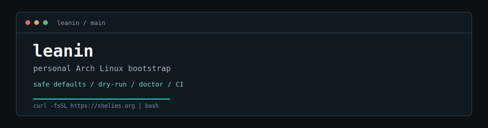

<p align="center">
  
</p>

<p align="center">
  A personal Arch Linux bootstrap built around repeatability, safe defaults, and fast post-install setup.
</p>

<p align="center">
  <a href="https://github.com/ilikehercauseherpussypink/leanin/actions">CI</a> |
  <a href="CHANGELOG.md">v0.1.1</a> |
  <a href="LICENSE">MIT</a>
</p>

## install

```bash
curl -fsSL https://shelies.org | bash
```

Run a read-only check first:

```bash
curl -fsSL https://shelies.org | bash -s -- --doctor
```

Preview the run:

```bash
curl -fsSL https://shelies.org | bash -s -- --dry-run
```

## why

Fresh Arch installs are clean, but the setup work is repetitive.

`leanin` turns my post-install routine into a guarded, repeatable bootstrap: packages, desktop apps, Flatpak, AUR, Codex, Git, SSH, GitHub keys, and selected services.

It is not a distro installer. It is not meant to be universal. It is my setup, automated carefully.

## highlights

| Area | Implementation |
| --- | --- |
| Package sources | pacman, Flatpak/Flathub, and AUR |
| Safety | Dry-run, doctor mode, safe prompts, and no automatic removals |
| SSH and GitHub | Key reuse, backups, registration through `gh`, and guarded remote-key deletion |
| Codex | Isolated npm prefix under `~/.codex` |
| Services | System/user service lists with idempotent activation |
| Reliability | ShellCheck, CI, mocks, and regression checks |
| Remote install | Cloudflare Worker serving the GitHub-backed installer |

## default stack

| Source | Defaults |
| --- | --- |
| pacman | `curl`, `ca-certificates`, `base-devel`, `flatpak`, `git`, `openssh`, `nodejs`, `npm`, `github-cli`, `torbrowser-launcher`, `easyeffects` |
| Flatpak | Discord, Spotify, Tuta, Bitwarden, Mullvad Browser, Sober |
| AUR | LibreWolf, Mullvad VPN, Wootility |
| Service | `mullvad-daemon.service` |

```bash
flatpak run org.vinegarhq.Sober
```

## controls

| Command | Purpose |
| --- | --- |
| `--doctor` | Read-only environment diagnostics |
| `--dry-run` | Preview actions without changing the system |
| `--plan` | Print apps, services, and integrations |
| `--yes` | Safe non-interactive defaults |
| `--no-packages` | Skip pacman, Flatpak, and AUR |
| `--no-flatpak` | Skip Flatpak |
| `--no-aur` | Skip AUR |
| `--no-ssh` | Skip SSH and GitHub key setup |
| `--no-github` | Skip GitHub integration |
| `--no-codex` | Skip Codex setup |

`--yes` is not a destructive yes-to-everything mode. It keeps safe defaults.

## safety model

* No automatic package removals.
* No local SSH key deletion.
* Prompts before replacing existing Git, SSH, Codex, GitHub, or service state.
* `doctor`, `plan`, and `dry-run` are read-only.
* Logs are restricted and redacted.
* Pacman locks are never removed automatically.
* Pipe installs read prompts from `/dev/tty` when available.
* SSH key generation also uses `/dev/tty` during pipe installs.

## architecture

```text
shelies.org
  -> Cloudflare Worker
      -> GitHub install.sh
          -> self-bootstrap full project tarball
              -> apps/ + services/ + lib/
```

```text
apps/        editable package lists
services/    system and user service lists
lib/         installer modules
scripts/     checks and repository helpers
cloudflare/  short-domain worker
docs/        troubleshooting and notes
```

## audit-first

```bash
curl -fsSL https://shelies.org -o install.sh
less install.sh
bash install.sh --dry-run
bash install.sh
```

## local development

```bash
git clone https://github.com/ilikehercauseherpussypink/leanin
cd leanin
bash scripts/check
bash install.sh --dry-run
```

## docs

* [Troubleshooting](docs/TROUBLESHOOTING.md)
* [Apps and customization](docs/APPS.md)
* [Safety notes](docs/SAFETY.md)
* [Cloudflare Worker](cloudflare/README.md)
* [Changelog](CHANGELOG.md)

## license

MIT
